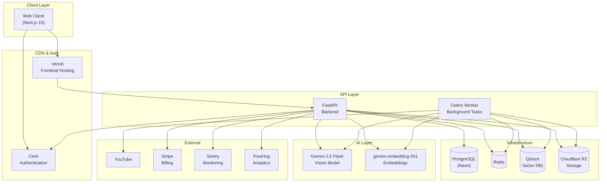
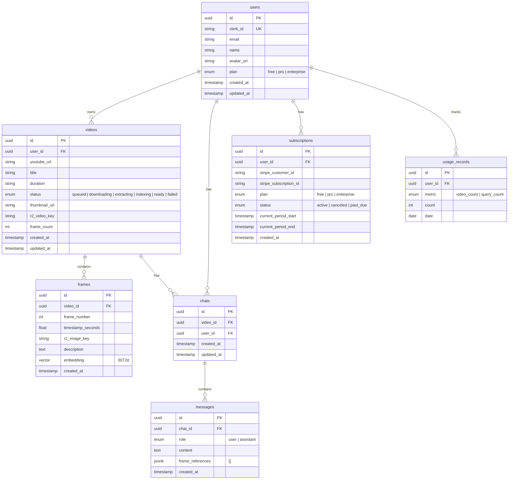
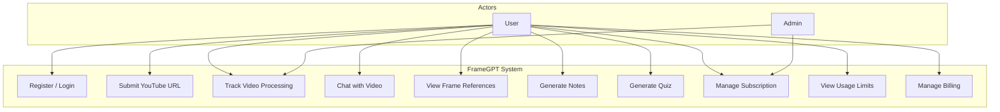
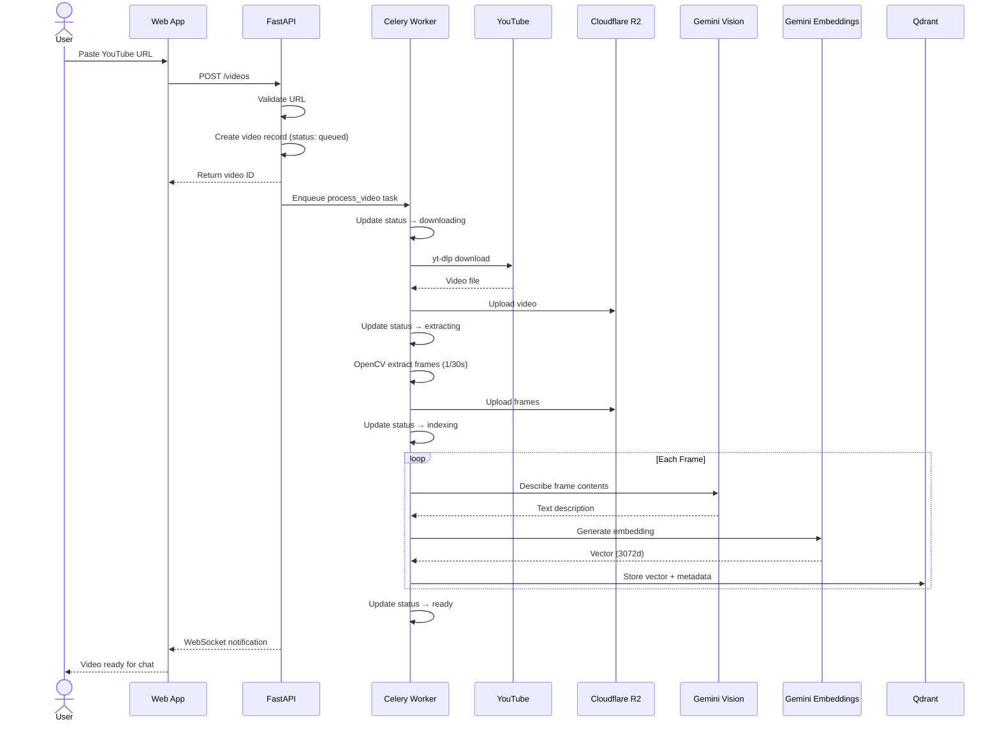
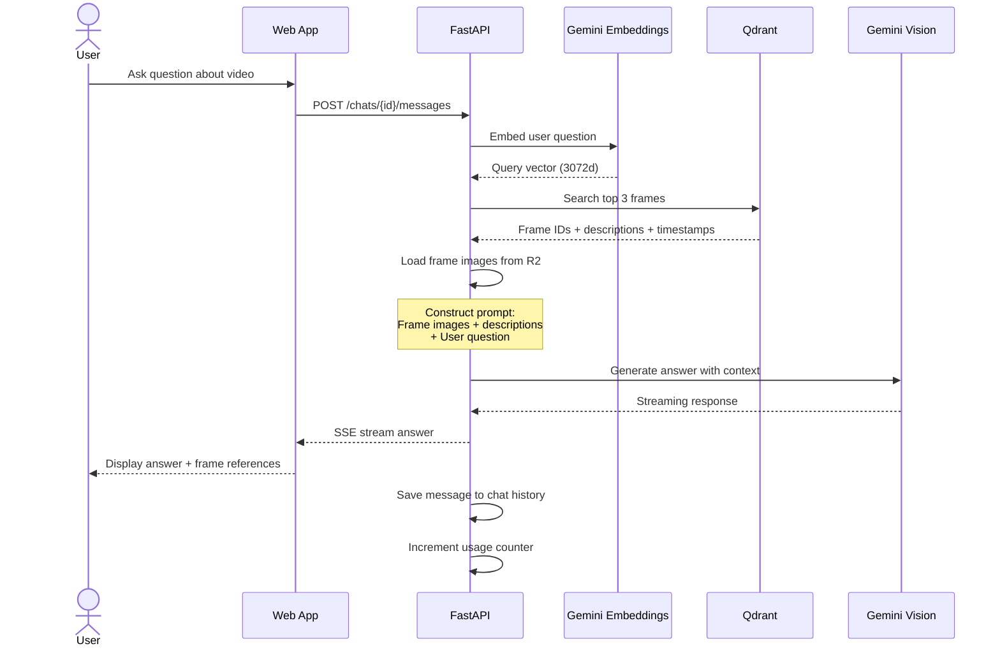
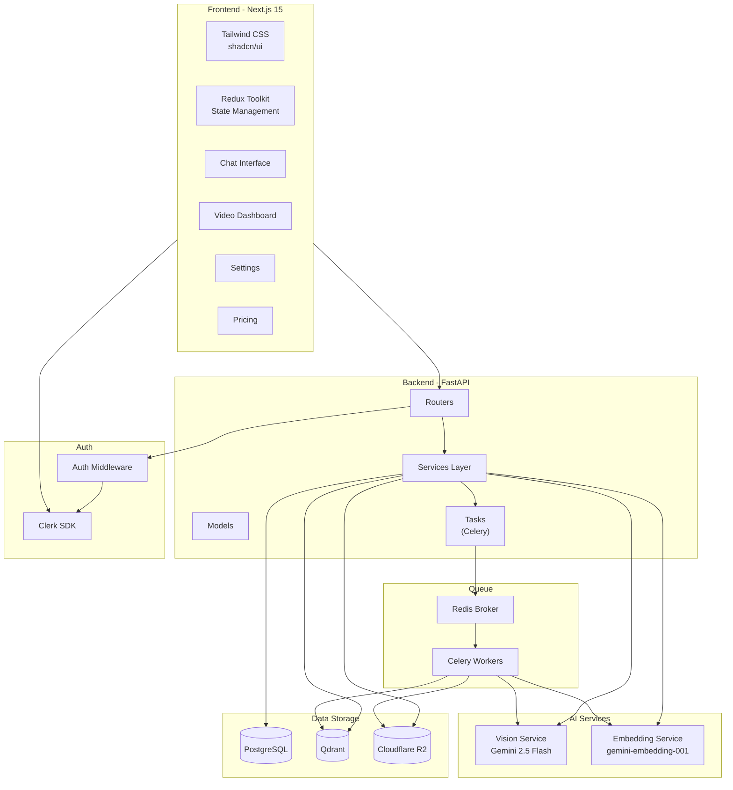
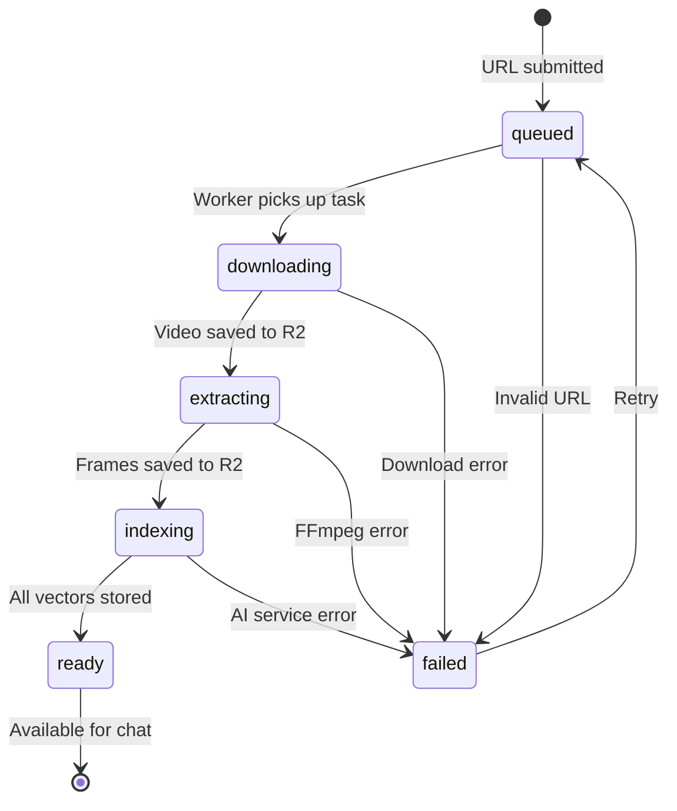
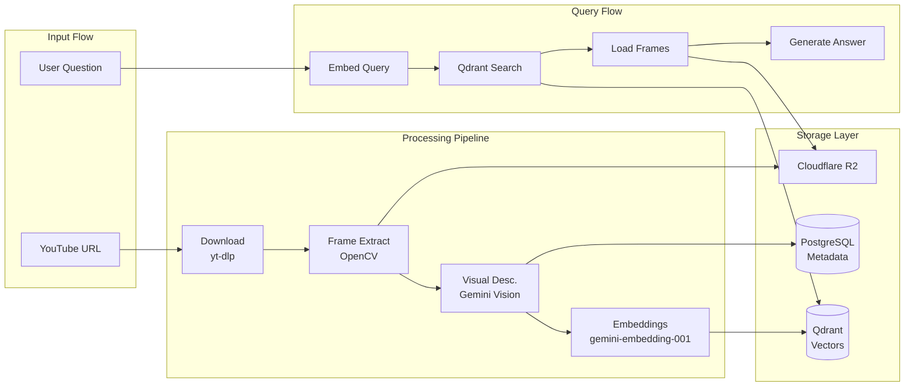

# Architecture & UML Diagrams

> Visual documentation for the FrameGPT system architecture, data models, and key workflows.

---

## 1. System Architecture (Deployment Diagram)



---

## 2. Entity Relationship Diagram (Database Models)



---

## 3. Use Case Diagram



---

## 4. Video Ingestion Sequence



---

## 5. Chat Query Sequence



---

## 6. Component Diagram



---

## 7. State Machine (Video Processing)



---

## 8. Data Flow Diagram



---

## 9. Directory Structure

```
framegpt/
├── apps/
│   ├── web/                         # Next.js 15 Frontend
│   │   ├── app/
│   │   │   ├── (auth)/              # Authentication pages
│   │   │   │   ├── login/
│   │   │   │   ├── register/
│   │   │   │   └── layout.tsx
│   │   │   ├── (dashboard)/         # Protected routes
│   │   │   │   ├── dashboard/
│   │   │   │   ├── videos/
│   │   │   │   │   └── [id]/
│   │   │   │   │       ├── page.tsx         # Video details
│   │   │   │   │       └── chat/
│   │   │   │   │           └── page.tsx     # Chat interface
│   │   │   │   ├── settings/
│   │   │   │   └── layout.tsx
│   │   │   ├── pricing/
│   │   │   ├── layout.tsx
│   │   │   └── page.tsx             # Landing page
│   │   ├── components/
│   │   │   ├── ui/                  # shadcn/ui components
│   │   │   ├── landing/
│   │   │   ├── dashboard/
│   │   │   ├── video/
│   │   │   └── chat/
│   │   ├── lib/
│   │   │   ├── store/               # Redux Toolkit store
│   │   │   ├── api/                 # API client
│   │   │   └── utils/
│   │   ├── middleware.ts            # Clerk auth middleware
│   │   ├── next.config.js
│   │   ├── tailwind.config.ts
│   │   └── package.json
│   │
│   └── api/                         # FastAPI Backend
│       ├── app/
│       │   ├── main.py
│       │   ├── config.py
│       │   ├── database.py
│       │   ├── routers/
│       │   │   ├── auth.py
│       │   │   ├── videos.py
│       │   │   ├── chats.py
│       │   │   ├── subscriptions.py
│       │   │   └── webhooks.py
│       │   ├── models/
│       │   │   ├── user.py
│       │   │   ├── video.py
│       │   │   ├── frame.py
│       │   │   ├── chat.py
│       │   │   └── subscription.py
│       │   ├── services/
│       │   │   ├── video_processor.py
│       │   │   ├── frame_extractor.py
│       │   │   ├── vision_service.py
│       │   │   ├── embedding_service.py
│       │   │   ├── vector_service.py
│       │   │   ├── storage_service.py
│       │   │   └── billing_service.py
│       │   ├── tasks/
│       │   │   ├── celery_app.py
│       │   │   └── process_video.py
│       │   └── schemas/
│       │       ├── video.py
│       │       ├── chat.py
│       │       └── user.py
│       ├── alembic/
│       │   └── versions/
│       ├── requirements.txt
│       └── Dockerfile
│
├── packages/
│   └── shared-types/                # Shared type definitions
│       ├── src/
│       │   ├── index.ts
│       │   ├── video.ts
│       │   ├── chat.ts
│       │   └── user.ts
│       ├── package.json
│       └── tsconfig.json
│
├── docs/
│   ├── ARCHITECTURE.md              # This file
│   ├── API.md                       # API specification
│   └── SETUP.md                     # Setup guide
│
├── .github/
│   └── workflows/
│       ├── ci.yml                   # CI pipeline
│       └── deploy.yml               # Deploy pipeline
│
├── docker-compose.yml
├── turbo.json
├── package.json                     # Root (Turborepo)
├── pnpm-workspace.yaml
└── README.md
```
